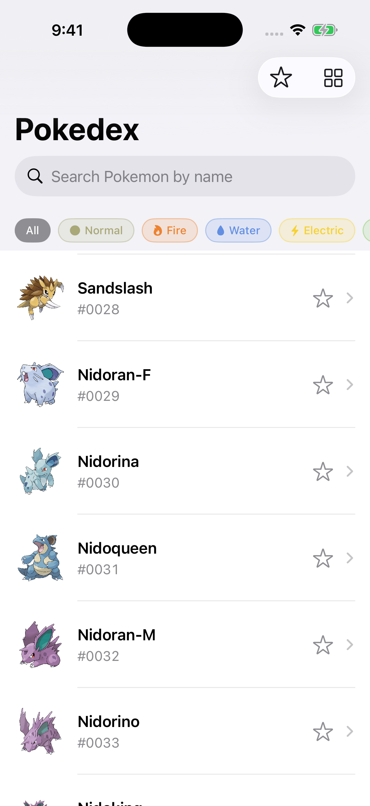
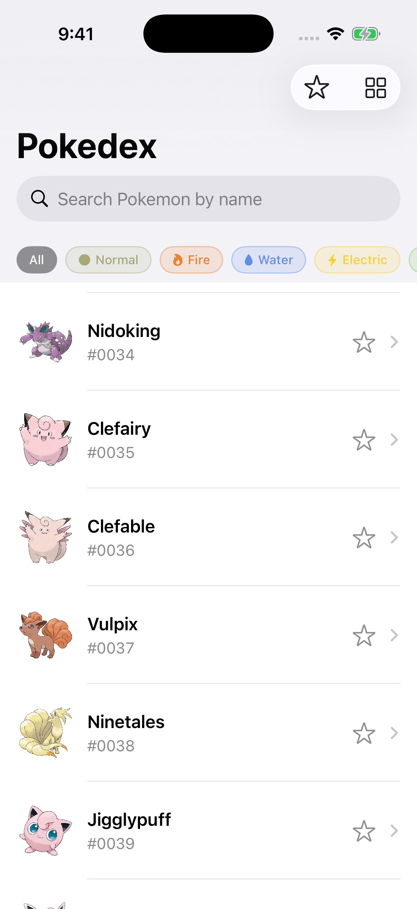

# Pokédex Tutorial — A Pedagogical SwiftUI App

A fully functional Pokédex app built to **teach modern iOS development** with Swift and SwiftUI. Every file is heavily documented with architectural rationale, design decisions, and educational commentary.

| | |
|---|---|
| **Platform** | iOS 17.0+ |
| **Language** | Swift 5 |
| **UI Framework** | SwiftUI |
| **Architecture** | MVVM + Protocol-Oriented Design |
| **Testing** | XCTest + XCUITest (24 tests) |
| **Data** | PokéAPI v2 (live) + Mock Service (local) |
| **Author** | enigmak9 |

## Screenshots

<p align="center">
  
  
</p>

## Features

- **Browse 1,300+ Pokémon** with official artwork and real-time API data
- **Search** with Combine-powered debounced filtering (300ms)
- **18-type filter chips** with official brand colors and SF Symbol icons
- **List/Grid toggle** with smooth animated transitions
- **Pokémon detail view** with stats bars, abilities, and type effectiveness
- **Favorites** persisted to UserDefaults with star toggle
- **Infinite scroll** pagination (20 per page)
- **Pull-to-refresh** to reload from API
- **Mock data service** for offline development and testing
- **Dark Mode**, Dynamic Type, and VoiceOver accessibility
- **24 automated tests** (model, ViewModel, API integration, UI)

## Quick Start

```bash
# Build
xcodebuild -project PokedexTutorial.xcodeproj \
  -scheme PokedexTutorial \
  -destination 'platform=iOS Simulator,name=iPhone 17 Pro' \
  build

# Run tests
xcodebuild -project PokedexTutorial.xcodeproj \
  -scheme PokedexTutorial \
  -destination 'platform=iOS Simulator,name=iPhone 17 Pro' \
  test

# Launch in simulator
xcrun simctl boot "iPhone 17 Pro" 2>/dev/null
xcrun simctl install "iPhone 17 Pro" \
  ~/Library/Developer/Xcode/DerivedData/PokedexTutorial-*/Build/Products/Debug-iphonesimulator/PokedexTutorial.app
xcrun simctl launch "iPhone 17 Pro" com.enigmak9.PokedexTutorial

# Or open in Xcode
open PokedexTutorial.xcodeproj
```

## Documentation

| Document | Audience | Content |
|----------|----------|---------|
| [docs/run.md](docs/run.md) | Everyone | Minimum steps to build, test, and run |
| [docs/architecture.md](docs/architecture.md) | Developers | Full architecture guide: MVVM, DI, concurrency, design decisions |
| [docs/flowcharts.md](docs/flowcharts.md) | Developers | 13 Mermaid diagrams: data flow, state machines, navigation, errors |
| [docs/user_guide.md](docs/user_guide.md) | Power Users | Customization recipes, debugging, extension points |
| [docs/latex/pokedex-guide.tex](docs/latex/pokedex-guide.tex) | Casual Users | Printable beginner guide with diagrams and troubleshooting |
| [PLAN.md](PLAN.md) | Learners | 7-step build plan with syllabus topics and checkpoints |

## Project Structure

```
PokedexTutorial/
├── App/            PokedexTutorialApp.swift          @main entry point, DI setup
├── Models/         Pokemon, PokemonType,             4 files, core data types
│                   PokemonDetail, LoadingState
├── Services/       Protocol, APIService, MockService 3 files, networking layer
├── ViewModels/     ListViewModel, DetailViewModel    2 files, UI state management
├── Views/          List, Detail, Row, Badge,         6 files, SwiftUI components
│                   StatBar, FilterChip
├── Stores/         FavoritesStore                    1 file, UserDefaults persistence
├── Extensions/     Color+Type, View+Extensions       2 files, reusable modifiers
└── Resources/      Assets, mock JSON                 Bundled fixtures
```

## Learning Path (Syllabus Order)

1. **Step 01** — Swift types, optionals, Codable (`Models/Pokemon.swift`)
2. **Step 02** — SwiftUI views, stacks, lists, modifiers (`Views/PokemonRowView.swift`)
3. **Step 03** — MVVM, ObservableObject, @Published, DI (`ViewModels/`)
4. **Step 04** — async/await, URLSession, error handling (`Services/PokemonAPIService.swift`)
5. **Step 05** — NavigationStack, value-based navigation, @Binding (`Views/PokemonDetailView.swift`)
6. **Step 06** — Combine, UserDefaults, @AppStorage (`ViewModels/PokemonListViewModel.swift`)
7. **Step 07** — Animations, accessibility, XCTest, XCUITest (`*Tests/`)

Each file contains detailed pedagogical comments explaining the WHY, not just the WHAT.

## Test Results

```
Executed 24 tests, with 0 failures (0 unexpected)
├── PokemonModelTests .............. 7 passed
├── PokemonListViewModelTests ..... 10 passed
├── PokemonAPIServiceTests ......... 7 passed
└── (UITests run in Xcode GUI)
```

## Requirements

- macOS 14.0+
- Xcode 15.2+
- iOS Simulator 17.0+
- Internet connection (for live API; optional with mock data)

## License

This project is an educational resource. Use it freely for learning purposes.

---

*Created by enigmak9, July 2026.*
