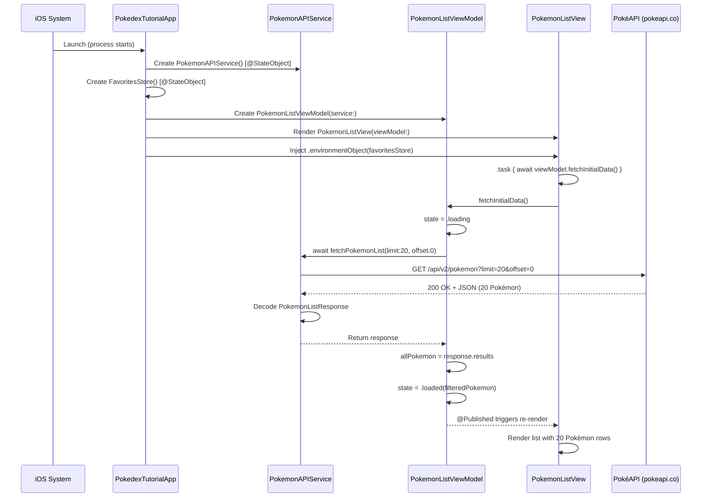
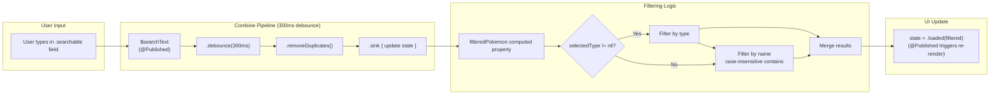
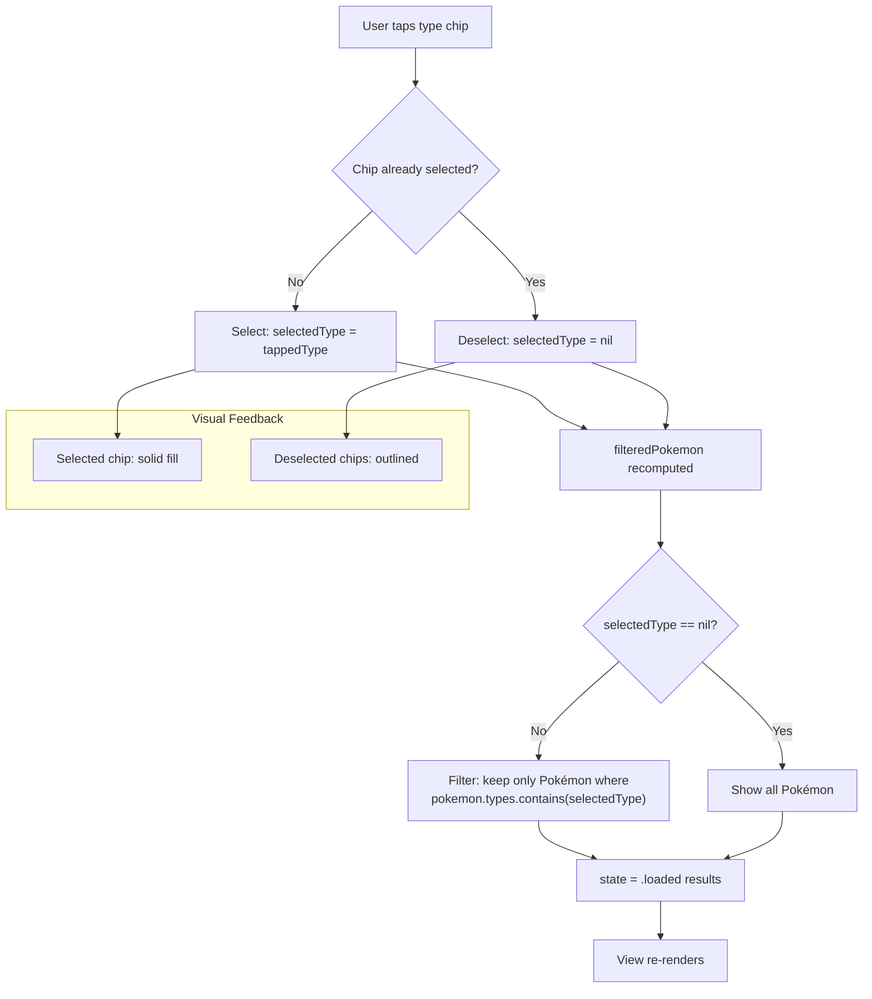
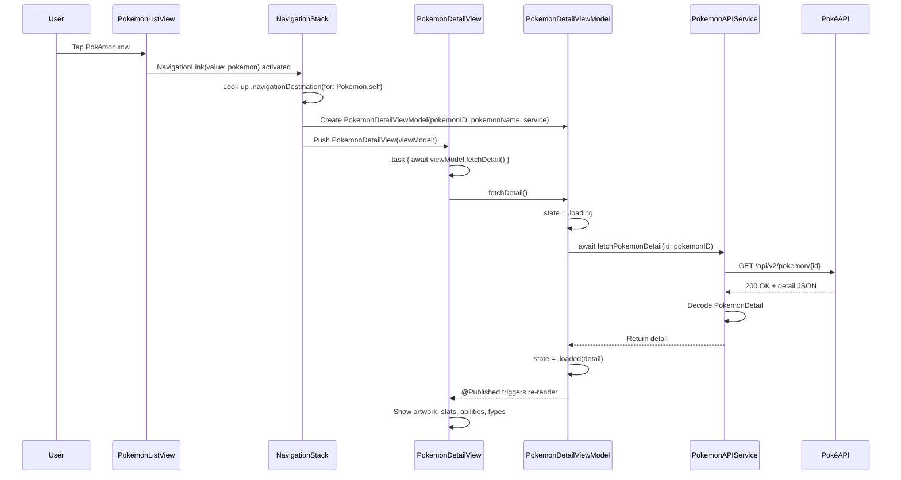
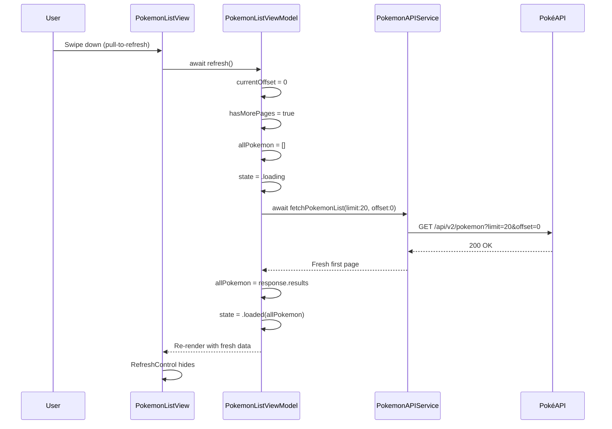
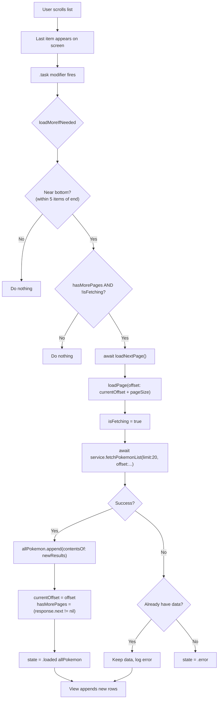
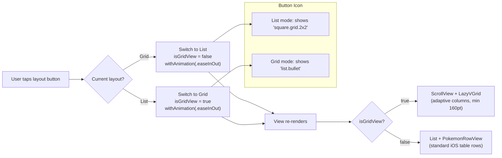
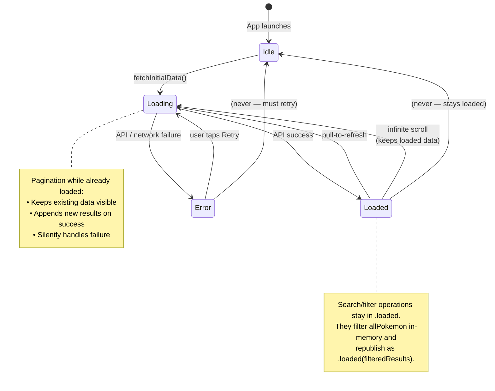
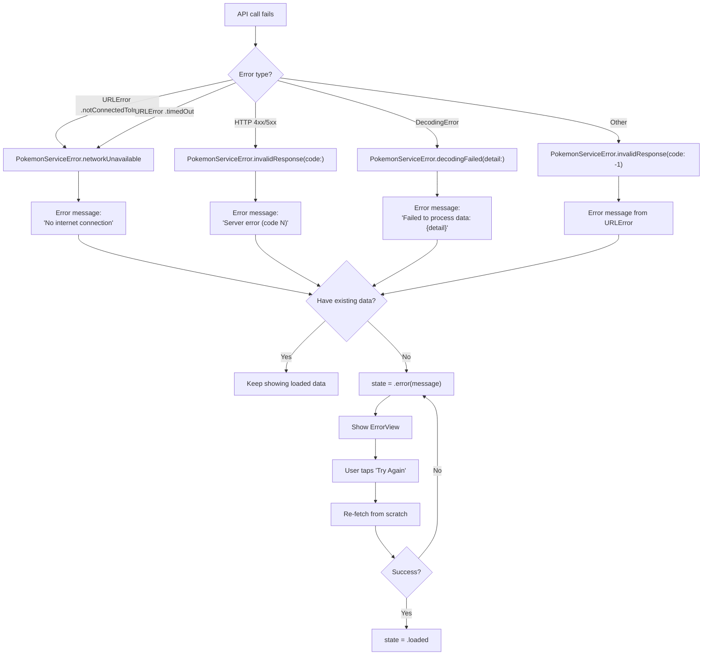
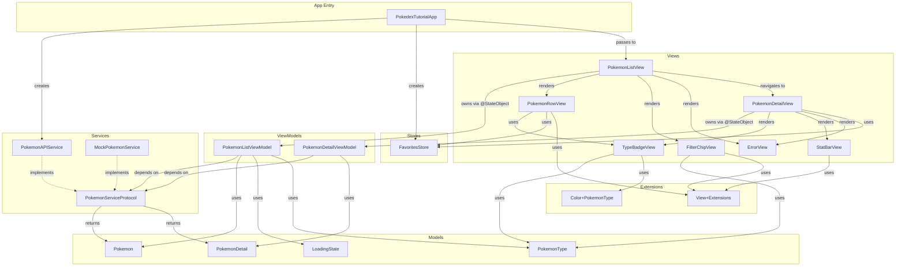

# Flowcharts — Pokédex Tutorial

**Created:** 2026-07-07 | **Last modified:** 2026-07-07 | **Author:** enigmak9

Visual documentation of all major flows in the app using Mermaid diagrams. These charts document the actual runtime behavior — every branch and state transition shown here is implemented in the code.

---

## Table of Contents

1. [App Launch Sequence](#1-app-launch-sequence)
2. [Pokémon List Loading](#2-pokémon-list-loading)
3. [Search Flow](#3-search-flow)
4. [Type Filtering Flow](#4-type-filtering-flow)
5. [Navigation to Detail](#5-navigation-to-detail)
6. [Detail Data Loading](#6-detail-data-loading)
7. [Favorites Toggle](#7-favorites-toggle)
8. [Pull-to-Refresh](#8-pull-to-refresh)
9. [Infinite Scroll (Pagination)](#9-infinite-scroll-pagination)
10. [Layout Toggle (List / Grid)](#10-layout-toggle-list--grid)
11. [Complete State Machine](#11-complete-state-machine)
12. [Error Recovery Flow](#12-error-recovery-flow)
13. [Component Dependency Graph](#13-component-dependency-graph)

---

## 1. App Launch Sequence



---

## 2. Pokémon List Loading

```mermaid
flowchart TD
    A[View appears] --> B{State?}
    B -->|.idle| C[Call fetchInitialData()]
    B -->|.loading| D[Show ProgressView spinner]
    B -->|.loaded| E[Show list]
    B -->|.error| F[Show ErrorView with retry]

    C --> G[state = .loading]
    G --> H[await service.fetchPokemonList]
    H --> I{Success?}
    I -->|Yes| J[allPokemon = results]
    J --> K[state = .loaded results]
    I -->|No| L{Already have data?}
    L -->|Yes| M[Keep loaded data, log error]
    L -->|No| N[state = .error message]

    K --> E
    N --> F
    M --> E
    D --> H

    F -->|User taps Retry| C
```

---

## 3. Search Flow



---

## 4. Type Filtering Flow



---

## 5. Navigation to Detail



---

## 6. Detail Data Loading

```mermaid
flowchart TD
    A[Detail view appears] --> B{state?}
    B -->|.idle| C[fetchDetail()]
    B -->|.loading| D[Show spinner]
    B -->|.loaded| E[Render full detail]
    B -->|.error| F[Show ErrorView]

    C --> G["state = .loading"]
    G --> H["await service.fetchPokemonDetail(id:)"]
    H --> I{Success?}
    I -->|Yes| J[state = .loaded detail]
    I -->|No| K[state = .error message]

    J --> E
    K --> F

    E --> L{User expands<br/>Type Effectiveness?}
    L -->|Yes| M[fetchTypeRelations()]
    M --> N[typeRelationsState = .loading]
    N --> O["await service.fetchTypeRelations(name:)"]
    O --> P{Success?}
    P -->|Yes| Q[Show weakness/resistance/immunity]
    P -->|No| R[Show error in section]
```

---

## 7. Favorites Toggle

```mermaid
flowchart TD
    A[User taps star button] --> B{favoritesStore.isFavorite id ?}
    B -->|Yes| C["Remove: favoriteIDs.remove(id)"]
    B -->|No| D["Add: favoriteIDs.insert(id)"]

    C --> E[saveFavorites()]
    D --> E

    E --> F["UserDefaults.standard.set(Array(favoriteIDs), forKey:)"]

    F --> G["@Published triggers view update"]

    G --> H[Star icon changes]
    H --> I{favoritesOnly filter active?}
    I -->|Yes| J[Filtered list re-renders]
    I -->|No| K[Just icon updates]

    subgraph "Animation"
        L[".spring(response:0.3, dampingFraction:0.6)"]
    end

    A --> L
    L --> H
```

---

## 8. Pull-to-Refresh



---

## 9. Infinite Scroll (Pagination)



---

## 10. Layout Toggle (List / Grid)



---

## 11. Complete State Machine



---

## 12. Error Recovery Flow



---

## 13. Component Dependency Graph



---

*These diagrams reflect the actual implementation. Every function call, state transition, and error path shown here is traceable in the source code.*
